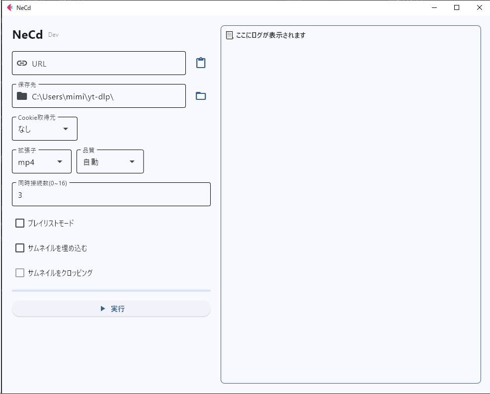

# NeCd


> [!WARNING]
> 来月(4月)中盤をめどに既存のいくつかの類似リポジトリをアーカイブします。  
> 今後のアップデートは行われません。

## 概要
YouTubeから動画をダウンロードするコマンドラインツール`yt-dlp`のGUIフロントエンドです。  
必要最小限の機能に絞り、使いやすいインターフェースを提供します。

## 機能
### ダウンロード形式と品質設定
- **対応フォーマット**
  - 動画: mp4, mkv
  - 音声: mp3, opus, flac
- **品質設定**
  - 動画: HD(720p)～4K(2160p)を選択可能
  - 音声: 128kbps～320kbpsを選択可能
  - その他の形式: 自動で最高品質を選択

### Cookie認証
- **対応方法**
  - テキストファイルからの読み込み
  - Firefoxブラウザからの読み込み
  - ※Firefoxベースの派生ブラウザでは動作しない場合があります

### ダウンロード設定
- **同時接続数**
  - デフォルトで有効（最大16接続）
  - 0に設定することで無効化可能
- **プレイリスト対応**
  - プレイリスト用の最適化された保存形式
  - タイトルとインデックスを含むファイル名で保存

### メタデータ設定
- **サムネイル**
  - 埋め込み機能
  - 1:1比率へのクロップ機能（音楽ファイル向け）
- **チャプター**
  - 動画へのチャプター情報の埋め込み
- **メタデータ**
  - タイトル、アーティスト、アルバム情報などの自動埋め込み

## 動作確認済み環境
いずれもPython 3.10.xで動作確認済み
| OS | バイナリ | ソース | 備考 |
|---|---|---|-----|
|Windows 10 Pro 22H2 | ⭕ | ⭕ | ffmpegのインストールが必要 |
|ArchLinux | ⭕ | ⭕ | クリップボード機能に`xclip`が必要 |
|macOS 15 | ❌️ | ⭕ | バイナリビルドは非対応 |

※Windows以外のバイナリ配布は行いません（環境依存の問題のため）  
※ソースコードからpyinstallerを使用してビルドしてください

## 必要条件
### 必須ソフトウェア
- **Python 3.10以上**
  - アプリケーションの実行に必要
  - yt-dlpの動作にも必要

- **yt-dlp**
  - コア機能の実装に必須
  - インストールコマンド:
  ```bash
  pip install yt-dlp
  ```

- **ffmpeg**
  - ファイル変換、マージ、メタデータ埋め込みに必要
  - 各OSのパッケージマネージャーからインストール可能

### オプション
- **mutagen**
  - opus/flac形式へのメタデータ埋め込みに必要
  - インストールコマンド:
  ```bash
  pip install mutagen
  ```

## トラブルシューティング
### メタデータ埋め込みエラー
opusやflac形式にメタデータを埋め込む際にエラーが発生する場合は、`mutagen`ライブラリのインストールが必要です。

### 警告メッセージについて
「正常に完了しました」と表示された後に警告メッセージが表示される場合がありますが、これは正常な動作です。最終的に「✅ 正常に完了しました。」と表示されれば問題ありません。

### `nsig extraction failed` エラー


このエラーは主にyt-dlpのバージョンが古い場合に発生します。以下のコマンドで更新を確認してください：
```bash
yt-dlp -U
```

更新が必要な場合は、pipを使用してインストールした場合は以下のコマンドで更新してください：
```bash
pip install -U yt-dlp
```

## スクリーンショット



